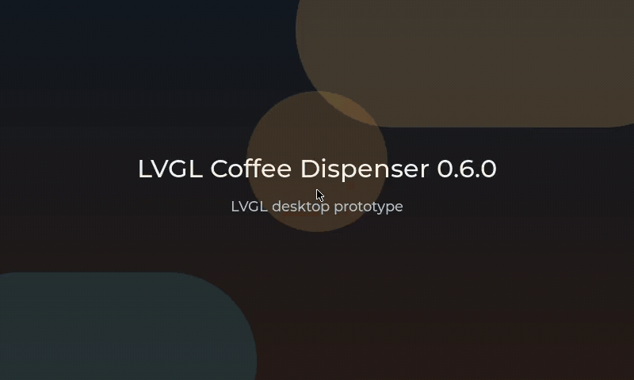

# LVGL Coffee Dispenser HMI

[](https://github.com/marcelpetrick/LVGL_coffeeDispenser/actions/workflows/ci.yml)
[](https://github.com/marcelpetrick/LVGL_coffeeDispenser/actions/workflows/release.yml)
[](LICENSE)
[](https://lvgl.io/)
[](https://www.libsdl.org/)
[](https://cmake.org/)
[](https://en.cppreference.com/w/c/23)
[](https://github.com/marcelpetrick/LVGL_coffeeDispenser/blob/master/README.md#quality-gate)
[](https://github.com/marcelpetrick/LVGL_coffeeDispenser/blob/master/README.md#quick-start)
[](https://github.com/marcelpetrick/LVGL_coffeeDispenser/blob/master/README.md#versioning)

A desktop-first LVGL prototype of a touch coffee-dispenser HMI: beverage selection, confirmation, dispensing progress, completion, cancellation, settings, diagnostics, and error handling. It runs on Linux/SDL2 against a simulated dispenser backend, with application logic, UI, service abstraction, platform helpers, tests, and tooling kept in separate layers.



**Author: Marcel Petrick <mail@marcelpetrick.it>**

**Note: projected is generated with AI.**

**License: GPLv3 or later. See [LICENSE](LICENSE).**


### View to showcase available LVGL elements for a quick preview & test


## Scope

| Included | Not included |
| --- | --- |
| SDL desktop simulator, 800 x 480, mouse as touch | Real pumps, valves, heaters, grinders, milk systems, sensors |
| Beverages: Coffee, Espresso, Latte Macchiato, Cappuccino, Americano, Hot Water | Appliance safety logic and certification |
| Simulated dispenser service behind a vtable, unit-tested controller state machine | Payment, cloud connectivity, user accounts |
| Local pipeline: build, test, format, coverage, Doxygen, Cppcheck, smoke launch | Localization beyond the prototype scope |

## Quick Start

Dependencies on Debian/Ubuntu-like systems (`cppcheck-htmlreport` is optional and only adds an HTML report):

```bash
sudo apt update
sudo apt install -y build-essential clang-format cmake cppcheck doxygen gcovr \
  graphviz ninja-build pkg-config libsdl2-dev git
```

Clone, build, run:

```bash
git submodule update --init --recursive
cmake --preset linux-debug            # or linux-release
cmake --build --preset linux-debug
./build/linux-debug/lvgl_coffee_dispenser
```

Headless run, e.g. for a smoke test:

```bash
SDL_VIDEODRIVER=dummy timeout 5s ./build/linux-debug/lvgl_coffee_dispenser
```

## Quality Gate

`localPipeline.sh` is the canonical gate; CI runs exactly the same script. It performs submodule init, the semantic-version check, configure, build, CTest, a non-mutating `clang-format` check, the coverage build with a **95% line-coverage threshold**, Doxygen with an empty-warning-log requirement, Cppcheck, and an optional smoke launch.

```bash
./localPipeline.sh --no-run          # skip the final smoke launch
./localPipeline.sh --verbose         # show the output of every stage
./localPipeline.sh --help            # all options
```

`tools/full_check.sh` is a compatibility wrapper that always adds `--no-run`.

The individual steps, should one of them need to be run alone:

```bash
ctest --preset linux-debug                                 # unit + smoke tests
find config src tests -type f \( -name '*.c' -o -name '*.h' \) -print \
  | xargs clang-format --dry-run --Werror                  # formatting
./scripts/run_cppcheck.sh --build-dir build/linux-debug    # static analysis
cmake --build build/linux-debug --target doxygen           # API documentation
cmake -S . -B build-coverage -G Ninja -DCMAKE_BUILD_TYPE=Debug \
  -DCOFFEE_BACKEND=SDL -DCOFFEE_BUILD_TESTS=ON -DCOFFEE_ENABLE_COVERAGE=ON
cmake --build build-coverage --target coverage-html        # coverage
```

Generated output:

| What | Where |
| --- | --- |
| Coverage | `build-coverage/coverage/{coverage.txt,summary.json,html/index.html}` |
| Doxygen | `build/linux-debug/doxygen/html/index.html`, `warnings.txt` |
| Cppcheck | `reports/cppcheck/cppcheck.xml`, `reports/cppcheck/html/index.html` |

The last local run reported 100% line, 100% function, and 93.0% branch coverage of `coffee_core`.

## Rendering Benchmark

The application can profile its own rendering: `COFFEE_PERF_PROFILE=1` hooks the LVGL render and flush events and logs `[PERF]` lines with the per-frame timings on exit, `COFFEE_PERF_FORCE_REDRAW=1` invalidates the whole screen every iteration so runs are comparable.

```bash
cmake --preset linux-release && cmake --build --preset linux-release
./scripts/run_render_benchmark.sh --pin-cpu 0                # 10 runs, headless, full redraw
./scripts/run_render_benchmark.sh --pin-cpu 0 \
  --compare build-of-the-other-version                       # alternating pairs, for comparisons
./scripts/run_render_benchmark.sh --runs 3 --idle            # idle UI instead
./scripts/run_render_benchmark.sh --video-driver x11         # real window
```

The script repeats the measurement ten times and writes `LVGL_<lvgl version>_benchmark.md` next to this file, with one row per run and the spread across them. `--pin-cpu` is worth using on any machine with frequency scaling or performance/efficiency cores: unpinned runs scatter far more than the differences being measured.

Current reports: [LVGL 9.6.0](LVGL_9.6.0_benchmark.md) and [LVGL 9.3.0](LVGL_9.3.0_benchmark.md), plus a rendered before/after comparison in [docs/benchmark-lvgl-9.3-vs-9.6.html](docs/benchmark-lvgl-9.3-vs-9.6.html). Short version: the 9.6 software renderer needs about 7% less CPU time per fully redrawn 800x480 frame (measured as back-to-back pairs, since the absolute numbers drift more than the effect), and costs about 1.8 MB more resident memory while LVGL's own heap grows by 1.3 KB.

## Demo Recording

The GIF above is generated, not hand-recorded: `COFFEE_DEMO_TOUR=1` makes the application click its own way through drink selection, dispensing, settings, and the widget showcase, and the recorder captures that on a private Xvfb display (needs `Xvfb` and `ffmpeg`, no input-injection tooling).

```bash
./scripts/record_demo_gif.sh                     # writes media/demo.gif
./scripts/record_demo_gif.sh --duration-s 15 --fps 15
```

## Versioning

Semantic versioning, with `project(... VERSION <major>.<minor>.<patch>)` in `CMakeLists.txt` as the single source of truth: it is compiled in as `COFFEE_APP_VERSION` and used as the Doxygen `PROJECT_NUMBER`.

- Every commit bumps at least the patch level.
- A notable feature bumps the minor level.
- The major level is bumped on explicit request only.

The pipeline enforces this: the version must be a valid `MAJOR.MINOR.PATCH` triple and greater than the baseline - the version at `HEAD` for a dirty working tree, at `HEAD~1` for a clean one.

## CI and Releases

- [`ci.yml`](.github/workflows/ci.yml) runs `./localPipeline.sh --no-run --verbose` on Ubuntu 24.04 for every push and pull request and uploads the coverage, Doxygen, and Cppcheck reports.
- [`release.yml`](.github/workflows/release.yml) reacts to a `v*` tag: it checks the tag against the project version, runs the same pipeline, builds the release preset, packages the build, starts the packaged binary headlessly, and publishes the archives.

```bash
git tag v0.3.5     # must equal the version in CMakeLists.txt
git push origin v0.3.5
```

A package can also be built locally:

```bash
cmake --preset linux-release
cmake --build --preset linux-release
./tools/package_linux.sh build/linux-release dist/lvgl-coffee-dispenser-linux-x86_64
```

## Architecture

The SDL integration is isolated from the core: the UI only requests state changes through `app_controller`, and the controller is the only component talking to a `coffee_dispenser_service_t`. Controller and beverage model are display-independent and unit-tested, so an embedded port keeps `src/app` and `src/service/dispenser_service.h` and replaces `src/main.c` plus the simulated service.

```
src/main.c        SDL bring-up, lv_init, tick loop
src/app/          beverage model + controller state machine (hardware-independent)
src/service/      dispenser service vtable + simulated implementation
src/ui/           ui_manager, theme (incl. screen transition), assets, screens
src/platform/     logging and time wrappers
config/           app_config.h + lv_conf.h
```

## Documentation

- [Requirements](documents/00_requirements.md) - what the prototype is supposed to do.
- [Architecture](docs/architecture.md) - layering rules and the UI/controller/service split.
- [UI flow](docs/ui-flow.md) - screens and the transitions between them.
- [Build and deploy](docs/build-and-deploy.md) - build paths, tooling outputs, packaging.
- [Renderer comparison](docs/benchmark-lvgl-9.3-vs-9.6.html) - LVGL 9.3.0 against 9.6.0 on this HMI, rendered.
- [Agent guide](AGENTS.md) - repository conventions for coding agents.
- [Software engineering plan](SWE_PLAN.md) - the engineering plan this repository follows.
- [License](LICENSE) - GPLv3 or later.
